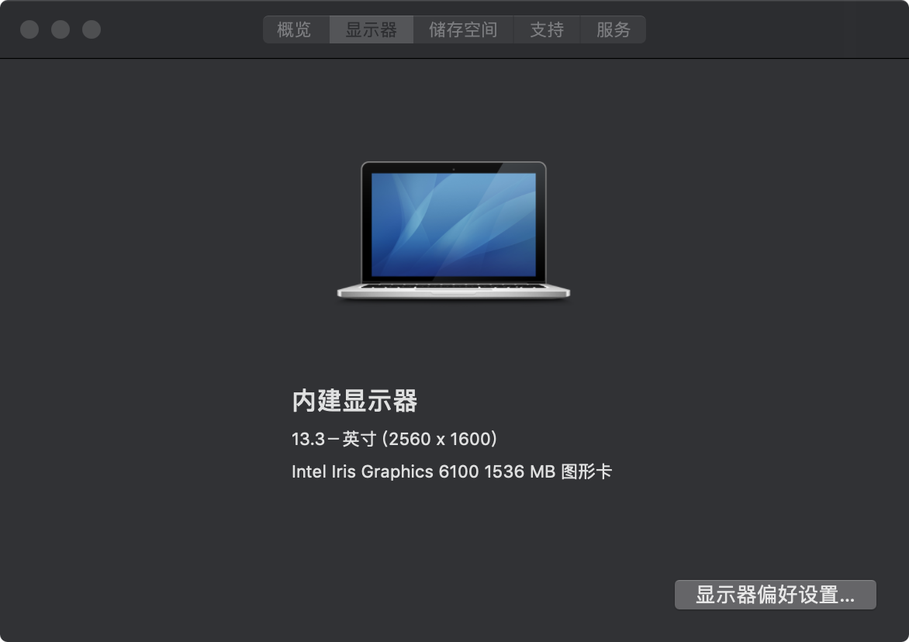
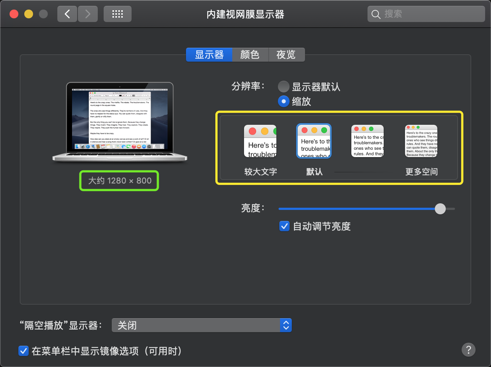

# CSS 长度单位

CSS 中设置大小是基本操作，本节介绍常用的长度单位。width, height, margin, padding, border-width, font-size, 和 text-shadow 等等 CSS 属性都需要使用长度单位。

## 像素 px
浏览器的像素与设备像素(device pixel)**不一样**。我们在 CSS 中设置的像素实际为**逻辑像素**。为了了解清楚其区别和缘由，必须先解释下设备像素，DPI，DPPX 和逻辑分辨率。

一般的显示器是由一个一个微小的可发光的灯一排一排组成，每个灯叫“像素 (pixel)”。如果一个显示器的分辨率是 1920×1080，代表每一排有 1920 个像素，一共有 1080 排。所以，同样面积分辨率越大，画面就越细腻，因为有更密集的像素点，甚至肉眼无法看到屏幕的像素点，即所谓“视网膜屏幕”。这个属性是生产好显示器就确定了的，称作：**设备分辨率**和**设备像素**。有时候也称为物理分辨率。

分辨率 1280×720px 经常被称作 720p。分辨率 1920×1080px 经常被称作 1080p，如果水平像素点达到 2000 左右，可以被称为 2k 分辨率，例如 2560×1600px，如果水平像素点达到 4000 左右，可以被称作 4k 分辨率，例如 3840×2160px。

### DPI(Dots per inch), PPI(Pixels per inch)

分辨率和像素的密集程度没有关系，因为分辨率不反映面积，而反应像素密集程度的单位是 DPI(Dots per inch) 或者严格说来对于显示器是 PPI(Pixels per inch), 不过很多场合这两者不作区分，这里为了方便直接称作 DPI。

显示器的物理大小通常不会相差很大，特别是笔记本，家用台式机。因此 2k/4k 分辨率的显示器，通常会有更高的 DPI。也能够显示更细致的画面。

### 逻辑分辨率(Logic Resolution)
试想一下，如果我们有一个 100px 的图，我们的显示器是 1080p 的，现在我们升级显示器到 4k 分辨率的(屏幕尺寸不变，即 4 倍 DPI)，这张图就会变成之前的 1/4 大小，文字也是同样的现象。这当然不是我们希望的，因为我们的眼睛没有跟屏幕一起升级，无法轻松辨认原先 1/4 大小的文字或图像。

于是操作系统设计了**逻辑分辨率(Logic Resolution)**，可以让 4k 的显示器的逻辑分辨率为 1920×1080，让 4 个设备像素显示原来的 1 个设备像素，这样我们的 100px 的图片就不会过分缩小了。

### DPPX(Dots per px unit) & Device Pixel Ratio
在上面的例子中，我们将 4K 的显示器设置了 1920×1080 的逻辑分辨率。因此现在的 1 个逻辑像素，其实是有 4 个设备像素显示的，即 4 DPPX(Dots per px unit)，设备像素比(Device Pixel Ratio)为 4。其中 DPPX 是的 w3c 标准化的名称，Device Pixel Ratio 会在一些旧的浏览器及文档中使用。

Windows 和 Mac 都可以设置显示的逻辑分辨率，以这台 Mac 为例：

设备分辨率(物理分辨率)为 2560×1600：


当前设置的逻辑分辨率为 1280×800：


设置好逻辑分辨率，我们的图片，文字就不会在不同 DPI 显示器显示的大小差异很大了。

但是这里有个问题：上文的例子中，原本 100×100px 的图片在高 DPI 的显示器上，用 400×400 个物理像素显示，那多余的像素怎么来呢？操作系统或者软件会进行缩放计算，得出应该填充的像素颜色。如果 dpi 是原先的两倍，那么 3/4 的像素都是计算得出的，因此图片会变的模糊。这种情况可以在高 DPI 的情况下使用同样图片的高分辨率版本，同时设置逻辑像素不变。例如将 400×400px 的图片，在 4 DPPX 的显示器上设置为 100×100px 的大小显示。通过 **CSS 媒体查询(Media query)** 技术可以实现。另外如果图片是“矢量图”的话，则可以自动适应不同的 DPPX，例如 SVG 图片。

在 HTML/CSS 中，设置的像素 px 实际是设置的和逻辑分辨率对应的**逻辑像素**，例如：
```css
p {
  width: 500px;
  font-size: 20px;
}
```

## rem & em
px 是绝对单位(absolute units)，CSS 中还有相对单位，例如 rem 和 em。这两者都是相对于字体大小(`font-size`)的单位，1 rem 就是 1 倍字体大小，2 rem 就是 2倍字体大小。区别是相对于的字体来源，rem 是相对于根元素（即 html 元素）的字体(`font-size`)大小，而 em 是相对于当前继承的`font-size`大小。由于 em 受`font-size`的继承关系影响，因此推荐使用 rem 作单位。

## vh && vw
vh(viewport height) 代表 viewport 高度的 1% 大小，vw(viewport width) 代表 viewport 高度的 1% 大小。

viewport 即浏览器的可见区域。不一定和网页一样大，例如：调节浏览器放大网页，这时候网页可能变的比浏览器更大，浏览器就好像一个窗口一样，通过他来看到整个网页的一部分，所以叫做 viewport。如果希望一个元素能正好和浏览器显示区域一样大，那么可以设置：
```css
#fullsize {
  height: 100vh;
  width: 100vw;
}
```

## 百分比单位
百分比单位可以设置一个元素的大小为其父元素的一个百分比，父元素放大/缩小，子元素也会随之改变。例如：

```html
<style>
  .parent300 {
    width: 300px;
  }
  .parent500 {
    width: 500px;
    margin-top: 30px;
  }
  .percentage50 {
    height: 30px;
    width: 50%;
    background-color: blue;
  }
</style>
<div class="parent300">
  <div class="percentage50">
  </div>
</div>
<div class="parent500">
  <div class="percentage50">
  </div>
</div>
```

<style>
  .parent300 {
    width: 300px;
    background-color: #888;
  }
  .parent500 {
    width: 500px;
    background-color: #888;
    margin-top: 10px;
  }
  .percentage50 {
    height: 30px;
    width: 50%;
    background-color: blue;
  }
</style>
<div class="parent300">
  <div class="percentage50">
  </div>
</div>
<div class="parent500">
  <div class="percentage50">
  </div>
</div>

百分比使用在`font-size`时相对的不是父元素，而是继承到的`font-size`大小，和 em 效果相同。例如 `font-size: 200%` 和 `font-size: 2em` 效果一样。

## 0
在使用 0 时不需要加单位。例如 `margin: 0`。

## 其他长度单位
上文介绍了常用的长度单位，可以满足常见需求。
其他长度单位可以查看[MDN 文档：values & units](https://developer.mozilla.org/en-US/docs/Learn/CSS/Introduction_to_CSS/Values_and_units)

## 参考
- https://www.wikiwand.com/en/2K_resolution
- 查询各设备的 DPI: http://dpi.lv/
- pixels physical vs logical https://blog.specctr.com/pixels-physical-vs-logical-c84710199d62
- DPPX https://www.w3.org/TR/css-values-4/#dppx