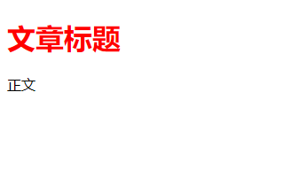

# 网站概述

本章概括性的描述了做网站涉及到的各种概念，运行原理，是整本书的基础。例如：浏览器，网络通信，HTTP，服务器，HTML/CSS/JavaScript。通过本章的介绍，读者可以对 Web 的构成，涉及到的软件和技术有一个概览，知道一个简单的网站是如何工作的。

## 一点历史

### 英特网(Internet)与万维网(World Wide Web)

英特网与万维网是两件事，却经常被混淆。英特网是无数设备通过 TCP/IP 协议组成的网络。TCP/IP 是互联网底层的一系列协议，他规定了软件，硬件该如何设计，不同设备之间该如何通信。所谓协议可以理解为一个标准，不同的厂家都遵守这个标准，那么大家就都能够通信了。比如思科的设备可以连接华为的，比如 windows 系统可以网络连接 Mac 电脑，都是因为有了 TCP/IP 标准(以及一系列其他标准)。之所以说是“底层”协议，是因为英特网只规定了最基本的通信方式，能够通信就可以了。至于能用来做什么应用，具体应用的使用场景 TCP/IP 是不管的。

好了，有了英特网了，所有电脑，设备都有了通信的可能，那么我们通信做什么呢？这个时候，有个人站出来了，他是 **Sir Timothy John Berners-Lee** 下文简称 TimBL。

TimBL 在 1989 年的时候发表了一个提案：[Information Management: A Proposal](https://www.w3.org/History/1989/proposal.html) ，在这个提案中，描述了一个分布式超文本系统(a distributed hypertext system)。这个就是万维网的雏形。其中**分布式**表示信息存储在不同的机器上，**超文本**就是信息的展示方式。之所以叫超文本，是他比纯文本(即纯文字)多了一些功能：他可以链接到其他的地方，所以网页上的链接叫做“超链接(Hyperlink)” 。

在 1990 年圣诞节的时候 TimBL 已经完成了万维网所有必要的工具软件，包括：HTTP 0.9, HTML, 第一个浏览器，第一个HTTP 服务器软件，第一台 web 服务器（ http://info.cern.ch/ ），以及用来描述这个项目的第一个网页。

经过数个版本的迭代，无数工程师，多家公司的努力工作形成了今天大家看到的万维网。不过基本的元素还是 1990 年 TimBL 的那几个。下面我们分别解释一下这些概念。

## 一些概念

### 服务器 (Server)

用户访问网页，具体的工作就用浏览器是从其他人的机器上下载网页到自己的机器查看。这里面其他人的机器，因为有提供网页的服务，因此称为“服务器”。服务器可以分配域名，比如 google.com 是一个域名。TODO: 域名解释

### 网页服务器软件 (Web Server)

服务器这台机器中，提供服务的软件，叫做网页服务器软件。这个软件一直保持运行，一旦接受到了用户发送的请求，便会根据请求返回给用户响应的资源。流行的服务器软件有 Nginx, Apache, IIS 等。

### HTML (Hypertext Markup Language)

网页的作者，把自己想要展示的内容，以一定的格式表示出来，存放在服务器，由服务器发送给请求访问的用户。这种格式名叫 HTML。最新的版本叫 HTML5。一个简单的 HTML 文件的例子：

```html
<!DOCTYPE html>
<html>
    <head>
        <meta charset="UTF-8">
        <title>文档名</title>
    </head>
    <body>
        <h1>文章标题</h1>
        <p>正文</p>
    </body>
</html>
```

以上 HTML 源代码不是给浏览网页的用户看的，用户会看到浏览器渲染后的样子:


现在不理解上面的格式没有关系，以后的章节中有详细教程。

### CSS (层叠样式表 Cascading Style Sheets)

HTML 越来越流行，但有一个需求没有很好的被满足：可以让网页有自定义的样式。开发者和网页设计师需要更自由的控制网页的展示效果，比如布局方式，边框，背景色，背景图片，按钮样式等等。HTML 的布局能力非常有限，如果把非常复杂的样式设计到 HTML 中，那么 HTML 会非常复杂，冗长；另外分离内容与样式，也是一个很好的实践方式。因此，在 1994 年，[Håkon Wium Lie](https://www.wikiwand.com/en/H%C3%A5kon_Wium_Lie) 发表了自己的样式表提案，这提案成为了后来的 CSS。下面是一个简单的 CSS 例子。

```css
h1 {
    color: red;
}
```

上面的 CSS 规定了 h1 元素的文字颜色是红色。如果把上面的 CSS 应用到之前 HTML 的例子，用浏览器打开效果如下：




如果现在不理解上面的内容，或者不知道 h1 是什么也没有关系。在 CSS 章节有详细解释。

### JavaScript

HTML 和 CSS 只是信息的展示。如果说浏览器或者 web 能够成为一个应用平台，那还是不够的。还需要能够完成一些逻辑性的工作，例如：在用户输入邮箱的时候，检查邮箱格式是否正确。这时候，就需要一门编程语言，这门语言就是 JavaScript。他由 Brendan Eich 最初设计实现。经过标准化(标准化的名字称为 ECMAScript，可以认为和 JavaScript 是一种东西的两种称谓)，以及多个版本的发展，现在 JavaScript 功能十分强大，甚至有了 NodeJS 这样浏览器以外的平台。根据[统计](https://githut.info/)JavaScript 是 Github 上最活跃的语言（2019年2月）。下面是一个简单的 JavaScript 语言的例子。

```javascript
window.alert('hello world')
```

这个例子中，使用了 window 对象(即浏览器提供的一个对象，他代表浏览器窗口)的功能，弹出提示“hello world”。用浏览器打开会弹出对话框，效果如下：


如果现在不理解上面的内容，或者不知道什么是 window，什么是对象，也没有关系。在 JavaScript 章节中会专门解释。

### 浏览器

浏览器是浏览网页用的软件。他会根据用户输入的 URL，或者点击的超链接，将相应服务器(Web Server)上的网页下载下来，并根据 HTML/CSS/JavaScript 源文件，渲染出最用用户看到的样子。流行的浏览器有 Chrome, Firefox, Edge 等。

### HTTP (Hypertext Transfer Protocol)

浏览器从服务器下载网页需要有一个协议，TimBL 专门为万维网设计了一个请求/响应(request/response)式的协议，该协议建立在 TCP/IP 之上。这个协议规定了请求和响应的工作方式，以及请求和相应的格式。即浏览器向服务器按规定的格式发送消息(请求 request)，服务器根据消息，返回给浏览器相应的 HTML 或者其他资源(响应 response)。HTTP 最新版本是2.0，不过没有普及。

### URL (Uniform Resource Locator) 统一资源定位符

万维网上有 HTML 网页，有图片等无数资源 (Resource)，这些资源的位置需要有个地址定位，就像每户人家都有自己的门牌号。有了 URL 就可以访问相应的资源了。我们经常说的网址就是 URL。例如 https://en.wikipedia.org/wiki/URL。浏览器就是根据 URL 来访问服务器下载网页的。

### 更多概念

有一些概念本章中没有介绍例如：域名，DNS 服务，NodeJS，后端等。这些内容会在以后的章节中介绍，不影响现阶段的学习。

## 网页的相关工作过程

了解了以上概念后，我们就可以联系起来，整理出一个典型的用户访问网页的流程。TODO: 配图

1. 用户打开浏览器软件
2. 用户在浏览器的地址栏中，输入 URL，并访问
3. 浏览器根据 URL，向相应的服务器发送 HTTP 请求
4. 服务器中的网页服务器软件 (Web Server)，接收到了 HTTP 请求，向用户的浏览器返回 HTML
5. 浏览器获得了 URL 对应的 HTML，渲染并展示在屏幕上

与之对应的，一个典型的 Web 开发者工作的流程是这样：

1. 编辑 HTML/CSS/JavaScript 文件
2. 配置好域名，服务器，以及网页服务器软件 (Web Server)
3. 将编辑好的文件部署到服务器上

## 参考资料

- https://en.wikipedia.org/wiki/Cascading_Style_Sheets
- https://en.wikipedia.org/wiki/History_of_the_World_Wide_Web
- https://www.w3.org/Style/CSS20/history.html

